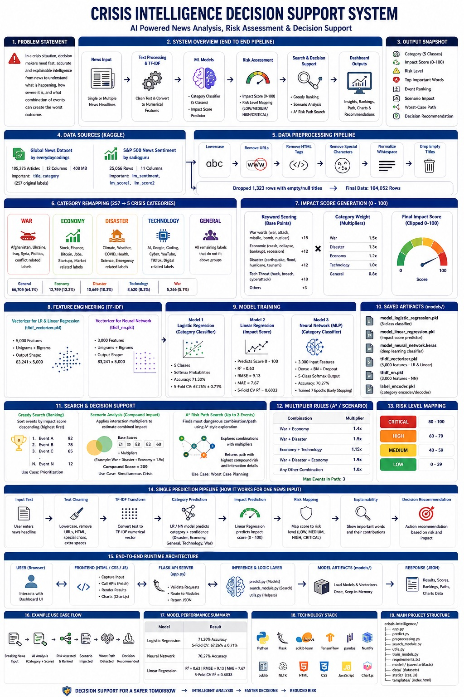

# Crisis Intelligence Decision Support System

A Flask-based AI decision support system for crisis news analysis. The app classifies a news item into one of five categories, predicts its impact score, assigns a risk level, and ranks or combines multiple events with search algorithms.

## What The System Does

The system takes crisis-related text input and produces:

- A category prediction from 5 classes: Disaster, Economy, General, Technology, War
- An impact score from 0 to 100
- A risk label derived from the impact score
- Explainability output showing important words in the input
- Greedy ranking of multiple events by impact score
- A* based search for the most dangerous combination of up to 3 events


### System Architecture



## Saved Models And Artifacts

The application is built around the following saved files in `models/`:

- `model_logistic_regression.pkl` - category classifier for the 5 crisis classes
- `model_linear_regression.pkl` - impact score regressor
- `model_neural_network.keras` - deep learning classifier
- `tfidf_vectorizer.pkl` - TF-IDF vectorizer for the logistic and linear models
- `tfidf_nn.pkl` - TF-IDF vectorizer for the neural network
- `label_encoder.pkl` - encodes and decodes category labels

These files are loaded directly at runtime by `predict.py`.

## Datasets Used

The project was trained from two Kaggle datasets:

- Global News Dataset - everydaycodings/global-news-dataset
  - 105,375 articles
  - 12 columns
  - Source: Kaggle
- S&P 500 News Sentiment - sadiqguru/s-and-p-500-news-sentiment
  - 25,066 rows
  - 11 columns
  - Source: Kaggle

## Model Performance

| Model | Result |
|---|---|
| Logistic Regression | 71.30% accuracy |
| Neural Network | 70.27% accuracy |
| Linear Regression | R²=0.63, RMSE=9.13, MAE=7.67 |
| 5-Fold CV (LR) | 67.26% ± 0.71% |

## Why We Use These Models And Techniques

This section explains the reason behind each major choice in the system. It is useful for viva questions like "Why did you use Linear Regression?" or "Why not only deep learning?"

### 1) Why TF-IDF for text features

We convert text into numbers using TF-IDF because:

- Our inputs are mostly short headlines, where keyword importance matters a lot.
- TF-IDF is fast to train and fast to infer, so it works well in a live dashboard.
- It is interpretable: we can show top words for explainability.
- It performs strongly with linear models on sparse text problems.

Why two vectorizers:

- `tfidf_vectorizer.pkl` (5000 features) is used for Logistic Regression and Linear Regression.
- `tfidf_nn.pkl` (3000 features) is used for Neural Network to keep input dimension smaller and training stable.

### 2) Why Logistic Regression for category classification

We use Logistic Regression as the main classifier because:

- It is a strong baseline for high-dimensional sparse text.
- It trains quickly and is stable.
- It outputs class probabilities, which we use as confidence.
- It is easier to explain than complex deep models.
- In this project, it achieved slightly better accuracy than the neural model (71.30% vs 70.27%).

Practical meaning:

- Logistic Regression is the best trade-off between accuracy, speed, and interpretability for this dataset.

### 3) Why Neural Network is still included

We include a Neural Network (MLP) because:

- It gives a second modeling approach for comparison and validation.
- It can capture non-linear feature interactions that linear models may miss.
- It demonstrates deep learning capability in the project architecture.

Why it is not the main winner here:

- For short sparse TF-IDF headlines, deeper models do not always beat linear methods.
- The dataset is imbalanced (General class dominates), so both models face minority-class recall challenges.

### 4) Why Linear Regression for impact score

Impact score is a continuous value from 0 to 100, so this is a regression task, not classification.

We use Linear Regression (Ridge-style saved model path) because:

- It is simple and reliable for numeric prediction on TF-IDF features.
- It is fast and lightweight for real-time API usage.
- It gives interpretable behavior and easy error metrics (MAE, RMSE, R²).

Why not a classifier for impact:

- A classifier would force buckets only (like low/medium/high).
- We need a continuous score first, then map that score to risk levels.

### 5) Why risk mapping thresholds are used

The score is mapped to operational labels:

- LOW: 0-39
- MEDIUM: 40-59
- HIGH: 60-79
- CRITICAL: 80-100

This separation is important because:

- Decision-makers understand risk labels faster than raw model numbers.
- It creates clear action policy bands for monitoring vs urgent response.

### 6) Why Greedy Search for ranking

Greedy Search is used in multi-event ranking because:

- The objective is straightforward: rank events by impact score descending.
- Complexity is efficient (sorting behavior, near O(n log n)).
- It is deterministic and easy to explain in demos.

### 7) Why A* style search for risk path/scenario

We use A* style logic for worst-case sequence finding because:

- Single-event ranking is not enough when interactions amplify risk.
- A* style exploration lets us evaluate combined event effects with multipliers.
- It returns a path/combination that is more useful for planning escalation responses.

In this project, combinations up to 3 events are used to balance realism and runtime speed.

### 8) Why these choices fit this project specifically

The project requires:

- Fast response in a web interface
- Explainability for viva and stakeholder trust
- Ability to handle both single-event and multi-event analysis
- Practical outputs (risk levels and ranked priorities), not just raw ML scores

Therefore, the final stack (TF-IDF + Logistic/Neural + Linear + Greedy/A*) is chosen as a practical engineering balance, not just a theory-only model comparison.

## Complete System Architecture

### Phase 1 - Environment Setup

The training workflow runs on Google Colab, so no local installation is needed for the training stage. Colab provides a free cloud notebook environment with Python, pandas, NumPy, scikit-learn, TensorFlow, GPU support, and enough RAM for this project.

The only requirement before starting is a Kaggle account and a `kaggle.json` API key file. This file contains your Kaggle username and API token and is used for authenticated dataset downloads.

### Phase 2 - Dataset Download

The system uses two Kaggle datasets:

- Global News Dataset by everydaycodings
  - 105,375 news articles
  - 12 columns
  - CSV size: 408 MB
  - Important columns: `title` for input text and `category` for the original label
- S&P 500 Stock Data with News Sentiment by sadiqguru
  - 25,066 rows
  - 11 columns
  - Used for exploratory analysis and correlation checking
  - Important columns: `lm_sentiment`, `lm_score1`, `lm_score2`

Both datasets are downloaded in Colab using `kagglehub` with Kaggle authentication.

### Phase 3 - Exploratory Data Analysis

Notebook 1 performs the EDA workflow:

- Basic inspection of shape, columns, data types, and sample rows
- Missing value analysis
  - `source_id` - 76.75% missing
  - `full_content` - 44.55% missing
  - `author` - 7.8% missing
  - `url_to_image` - 5.34% missing
  - `title` - only 0.04% missing, so it becomes the main text column
- Category distribution analysis
  - Original dataset contains 257 unique categories
  - Top categories include Stock, Health, Finance, and Technology
- Text length analysis
  - Most titles are 9 to 12 words long on average
- TF-IDF feature analysis
  - Top informative words include new, nyse, nasdaq, shares, stock, says, india, market, israel, and ai
- S&P 500 sentiment analysis
  - `lm_score1` vs `lm_level` correlation: 0.813
  - `lm_score2` vs `lm_level` correlation: 0.842
  - `lm_score1` vs `lm_score2` correlation: 0.821

At the end of Notebook 1, the cleaned dataframe is saved to `/content/news_cleaned.csv` and metadata is saved to `/content/dataset_info.pkl`.

### Phase 4 - Data Preprocessing

Notebook 2 checks for the saved files from Notebook 1. If they exist, it loads them directly. If not, it downloads the datasets again.

The preprocessing pipeline:

- Lowercases the headline text
- Removes URLs with regex
- Strips HTML tags
- Removes special characters and punctuation
- Normalizes extra whitespace

After cleaning, 1,323 rows were dropped because their title was empty or null, leaving 104,052 rows for training.

### Phase 5 - Category Remapping

The original 257 labels are not useful for a crisis intelligence system because labels such as country names do not directly describe crisis type. The project therefore remaps the labels into 5 crisis categories using a `CRISIS_MAP` dictionary.

- War - Afghanistan, Ukraine, Israel, Palestine, Iraq, Syria, Yemen, Libya, Myanmar, Somalia, Sudan, Russian Federation, Iran, Armenia, Politics
- Economy - Stock, Finance, Bitcoin, Cryptocurrency, Blockchain, Real estate, Jobs, Startups, Entrepreneurship
- Disaster - Climate, Weather, Sustainability, Science, Space, Antarctica, COVID, Health, Nutrition
- Technology - Technology, Artificial Intelligence, Coding, Virtual Reality, Google, Facebook, YouTube, Amazon, TikTok, Instagram
- General - everything else that does not fit the above four groups

After remapping, the distribution becomes:

- General - 66,708 articles, 64.1%
- Economy - 12,789 articles, 12.3%
- Disaster - 10,669 articles, 10.3%
- Technology - 8,620 articles, 8.3%
- War - 5,266 articles, 5.1%

### Phase 6 - Impact Score Generation

The dataset does not contain a native impact score column, so the project generates one using a rule-based formula:

- Crisis keywords add points to the base score
- War-related words such as war, attack, missile, bomb, nuclear add 15 points each
- Economic crash words such as crash, collapse, bankrupt, recession add 12 points each
- Disaster words such as earthquake, flood, hurricane, tsunami add 12 points each
- Tech threat words such as hack, cyberattack, breach add 10 points each

The keyword score is then multiplied by a category weight:

- War - 1.5
- Disaster - 1.3
- Economy - 1.2
- Technology - 1.0
- General - 0.8

The final value is clipped to 0 to 100.

### Phase 7 - TF-IDF Feature Extraction

TF-IDF means Term Frequency Inverse Document Frequency. It converts text into numerical vectors so machine learning models can process it.

The project creates two separate vectorizers:

- One vectorizer with 5,000 features for Logistic Regression and Linear Regression
- One vectorizer with 3,000 features for the Neural Network

Both use unigrams and bigrams. After fitting, the main model matrix becomes 83,241 rows by 5,000 columns. The dataset is split 80% for training and 20% for testing.

### Phase 8 - Model Training

Model 1 - Logistic Regression

Logistic Regression learns a weight for each TF-IDF feature and each class, then applies softmax to produce class probabilities. It achieved 71.30% test accuracy and 67.26% 5-fold cross-validation accuracy.

Model 2 - Linear Regression

Linear Regression predicts a continuous impact score between 0 and 100. It achieved R² = 0.6354, RMSE = 9.13, and MAE = 7.67. The 5-fold CV R² was 0.6033.

Model 3 - Neural Network

The neural network is a TensorFlow/Keras dense classifier with 3,000 input features, hidden Dense layers, BatchNormalization, Dropout, and a final 5-class softmax output. It was trained for 7 epochs with early stopping and achieved 70.27% test accuracy.

### Phase 9 - Search Algorithms

Greedy Search

Greedy Search sorts events by impact score in descending order. It always picks the locally highest-impact event first.

A* Search

A* is adapted for crisis scenario analysis. Instead of finding a graph path, it finds the most dangerous combination of up to 3 events.

The combo scoring uses the following multipliers:

- War + Economy = 1.4x
- War + Disaster = 1.5x
- Economy + Technology = 1.15x
- War + Disaster + Economy = 1.9x
- Any other combination = 1.0x

The combination with the highest final score is returned as the worst-case scenario.

### Phase 10 - Model Saving

After training, the models are saved to disk so the web app can load them without retraining.

- `model_logistic_regression.pkl` - trained Logistic Regression classifier
- `model_linear_regression.pkl` - trained Linear Regression model
- `model_neural_network.keras` - full Keras neural network model
- `tfidf_vectorizer.pkl` - 5,000-feature TF-IDF vectorizer for LR and Linear Regression
- `tfidf_nn.pkl` - 3,000-feature TF-IDF vectorizer for the neural network
- `label_encoder.pkl` - maps numeric outputs back to category names

### Phase 11 - Full Prediction Pipeline

When a user enters a headline in the app, the system performs the following steps:

1. Clean the text by lowercasing it, removing URLs, stripping HTML, removing special characters, and normalizing spaces.
2. Transform the cleaned text with `tfidf_vectorizer`.
3. Feed the vector into `model_logistic_regression` or `model_neural_network` to predict the category.
4. Feed the same vector into `model_linear_regression` to predict the impact score.
5. Map the impact score to a risk level:
   - below 40 = LOW
   - 40 to 59 = MEDIUM
   - 60 to 79 = HIGH
   - 80 and above = CRITICAL
6. If multiple events are entered, Greedy Search ranks them and A* finds the most dangerous combination of up to 3 events.
7. Produce a decision recommendation:
   - IMMEDIATE ACTION REQUIRED if any event is CRITICAL or the A* combined score is above 200
   - HIGH ALERT if the highest impact is above 70
   - MONITOR CLOSELY if the highest impact is above 50
   - NORMAL OPERATIONS otherwise

### Phase 12 - UI Layer

The UI layer is a Flask-served dashboard built to make the full AI system easy to use in a viva or demo. It is designed as a single-page experience with clear tabs and fast interactions.

Main UI sections:

- Analyze tab - single news headline classification, impact prediction, risk label, and explainability
- Multi-Event tab - greedy ranking of several events with impact bars and a chart
- Scenario tab - compound-risk simulation for simultaneous crises
- Risk Path tab - A* search output for the most dangerous event sequence
- Models tab - performance comparison view for the trained models

UI capabilities:

- Model selector for Logistic Regression and Neural Network
- Sample query buttons so the user can fill inputs without typing manually
- Add/remove event rows for multi-event analysis
- Loading overlay while predictions are running
- Result cards with category badges, risk badges, confidence, and impact meters
- Chart.js visualizations for ranking, scenario breakdown, and model comparison
- Explainability panel showing important words behind each prediction

The frontend communicates with the Flask backend entirely through API calls, so the interface is only a presentation and interaction layer while the prediction logic stays in the Python backend.

## How The Pipeline Works

### 1. Text preparation

Input text is cleaned before prediction:

- converted to lowercase
- URLs removed
- HTML and special characters removed
- extra whitespace normalized

### 2. Category prediction

The cleaned text is transformed with the matching TF-IDF vectorizer and passed to one of two classifiers:

- `model_logistic_regression.pkl` for the standard classification path
- `model_neural_network.keras` for the deep learning path

The neural network uses `tfidf_nn.pkl` and `label_encoder.pkl` to decode the output back into the 5 category names.

### 3. Impact prediction

The cleaned text is also transformed with `tfidf_vectorizer.pkl` and passed to `model_linear_regression.pkl` to predict the impact score.

### 4. Risk mapping

The impact score is mapped to a risk level:

- 0 to 39: LOW
- 40 to 59: MEDIUM
- 60 to 79: HIGH
- 80 to 100: CRITICAL

### 5. Multi-event search

The app supports two search strategies:

- Greedy Search: sorts events by impact score descending
- A* Search: finds the most dangerous combination of up to 3 events using the custom multiplier rules below

## End-to-End Runtime Architecture (Super Detailed)

This section explains the exact runtime behavior of the system from the moment a user clicks a button in the dashboard until the final cards and charts are rendered.

### A. Layered architecture

The running system is split into five layers:

1. Presentation Layer (Browser)
- `templates/index.html` defines tabs, forms, result containers, and cards.
- `static/js/app.js` captures user actions, performs API calls, and renders outputs.
- `static/js/charts.js` renders visual analytics (ranking, scenario, and model comparison charts).
- `static/css/style.css` handles visual styling, responsive layout, and badges.

2. API Layer (Flask routing)
- `app.py` exposes endpoints under `/api/*`.
- It validates request payloads, delegates processing to backend modules, and returns JSON responses.

3. Inference Layer (ML models)
- `predict.py` loads all saved models once, manages vectorizer selection, runs classifiers and regressor, and assembles prediction payloads.
- It also provides explainability and model comparison report loading.

4. Decision/Search Layer
- `search_module.py` runs greedy ranking, scenario amplification logic, and A* style risk-path exploration.
- This layer converts independent event predictions into decision-support outcomes.

5. Utility/Policy Layer
- `utils.py` handles risk thresholds, category metadata, formatting, and input validation.
- This layer ensures consistent labels, emojis, colors, and score-to-risk mapping.

### B. Startup lifecycle (what happens when server starts)

1. Flask app boots from `app.py`.
2. No model is loaded yet at import-time (lazy loading pattern).
3. On first prediction/comparison call, `predict.py` loads:
- `model_logistic_regression.pkl`
- `model_linear_regression.pkl`
- `model_neural_network.keras`
- `tfidf_vectorizer.pkl`
- `tfidf_nn.pkl`
- `label_encoder.pkl`
4. Loaded artifacts are cached in-memory for speed and reused for later requests.
5. If `models/accuracy_report.json` exists, model comparison reads from that file directly as the source of truth.

### C. Single-analysis runtime flow (Analyze tab)

User action:
- User enters text and selects model (Logistic Regression or Neural Network).
- User clicks Analyze.

Frontend behavior:
1. `analyzeSingle()` validates minimum input length.
2. Two parallel API calls are triggered:
- `POST /api/predict`
- `POST /api/explainability`
3. Loading overlay appears while waiting.

Backend prediction path (`/api/predict`):
1. `app.py` validates text.
2. `predict_single(text, model)` runs in `predict.py`.
3. Correct category vectorizer is selected:
- Logistic path -> `tfidf_vectorizer.pkl`
- Neural path -> `tfidf_nn.pkl`
4. Impact vectorizer always uses `tfidf_vectorizer.pkl` so impact scoring stays consistent.
5. Classifier predicts category probabilities.
6. Regressor predicts impact score in range 0-100.
7. `utils.py` maps impact score to risk tier:
- LOW: 0-39
- MEDIUM: 40-59
- HIGH: 60-79
- CRITICAL: 80-100
8. Response JSON returns category, score, confidence, model_used, and probability details.

Backend explainability path (`/api/explainability`):
1. Same input text and model are used.
2. Top TF-IDF terms are extracted from the active vectorizer.
3. If model coefficients are available, per-word contribution values are computed.
4. Natural-language explanation sentence is generated.
5. Frontend receives `top_features`, `category_weights`, and explanation text.

Frontend rendering:
1. Result cards show category, impact score meter, risk badge, and confidence.
2. Explainability panel shows strongest words and contribution direction.
3. Counters and chart animations run after data is inserted.

### D. Multi-event runtime flow (Multi-Event tab)

User action:
- User provides at least two events and clicks rank.

Backend path (`POST /api/rank`):
1. `predict_batch()` predicts category + impact for each event.
2. Each raw prediction is normalized via `format_prediction()`.
3. `greedy_rank_events()` sorts by impact descending.
4. Summary stats are computed (average impact, max impact, critical count).

Frontend rendering:
- Table view with rank numbers, category badge, impact bars, risk badges.
- Ranking chart for quick comparison.

### E. Scenario runtime flow (Scenario tab)

User action:
- User provides multiple events and clicks analyze scenario.

Backend path (`POST /api/scenario`):
1. Batch predictions are generated.
2. `analyze_scenario()` computes base score and interaction multipliers.
3. Pair/triple combinations are evaluated using custom multipliers.
4. Compound score is produced and mapped to risk level.
5. Scenario explanation text is returned.

Frontend rendering:
- Compound score card, multiplier card, and interaction cards.
- Scenario chart for base vs amplified impact.

### F. Risk path runtime flow (Risk Path tab)

User action:
- User enters multiple events and requests risk path.

Backend path (`POST /api/risk-path`):
1. Batch predictions are generated first.
2. `astar_risk_path()` searches for most dangerous event progression.
3. Up to 3-event combinations are explored with multiplier heuristics.
4. Returns optimal path, explored-node count, total compound risk, and interaction metadata.

Frontend rendering:
- Timeline-like path visualization with step cards and connectors.
- Aggregate risk stats and badges.

### G. Model comparison runtime flow (Models tab)

User action:
- User opens Models tab.

Backend path (`GET /api/models/compare`):
1. `predict.py` first tries to read `models/accuracy_report.json`.
2. If available, it is returned directly.
3. If missing, a report can be generated from available artifacts and dataset fallback logic.

Frontend normalization logic:
- Uses `test_accuracy` for headline accuracy.
- Uses `weighted_avg` for precision/recall/F1 display.
- Reads dataset metadata from `dataset` block (`total_samples`, `train_samples`, `test_samples`, feature counts).
- Displays architecture details for neural network from layered config.

### H. Data contract summary (key endpoint payloads)

1. `/api/predict`
- Input: `text`, `model`
- Output: `result` with category, impact_score, confidence, risk, metadata

2. `/api/predict-batch`
- Input: `texts[]`, `model`
- Output: `results[]`

3. `/api/rank`
- Input: `texts[]`, `model`
- Output: ranked events + aggregate stats

4. `/api/scenario`
- Input: `texts[]`
- Output: compound score, multipliers, interactions

5. `/api/risk-path`
- Input: `texts[]`
- Output: optimal path + search diagnostics

6. `/api/models/compare`
- Input: none
- Output: full report from `accuracy_report.json`

7. `/api/explainability`
- Input: `text`, `model`
- Output: top features, category weights, explanation sentence

### I. Reliability and guardrails

- Input validation blocks empty/very short text and malformed payloads.
- `try/except` wrappers in Flask routes return structured error messages.
- Model cache avoids repeated disk loading and reduces request latency.
- Risk boundaries are centralized so all tabs use the same thresholds.
- Frontend formatters handle missing values gracefully (`N/A`) instead of rendering `NaN`.

### J. Practical interpretation of outputs

- Category tells crisis type (what domain the event belongs to).
- Impact score tells estimated severity on a 0-100 scale.
- Risk level converts numeric score into operational urgency.
- Greedy ranking prioritizes highest-impact events first.
- A* scenario/risk path reveals dangerous combinations that single-event analysis can miss.
- Explainability offers word-level transparency for model trust during demo/viva.

## Search Rules

### Greedy Search

Greedy ranking simply orders events by impact score from highest to lowest.

### A* Search

A* search looks for the most dangerous combination of up to 3 events.

Combo multipliers:

- War + Economy = 1.4
- War + Disaster = 1.5
- Economy + Technology = 1.15
- War + Disaster + Economy = 1.9
- Any other combination = 1.0

The search result is returned in a path-like format so the frontend can render it as a sequence.

## Category Remapping

The original dataset contained 257 geographic and topical labels. These were consolidated into 5 crisis categories so the model output would be practical for decision support and easier to explain in a viva.

- War - Afghanistan, Ukraine, Iraq, Syria, Politics, conflict-related labels
- Economy - Stock, Finance, Bitcoin, Jobs, Startups, market-related labels
- Disaster - Climate, Weather, COVID, Health, Science, emergency-related labels
- Technology - AI, Google, YouTube, Coding, TikTok, digital and cyber-related labels
- General - all remaining labels that do not clearly belong to the four crisis groups above

## Project Structure

```text
crisis-intelligence/
  app.py
  predict.py
  preprocessing.py
  search_module.py
  utils.py
  train_models.py
  requirements.txt
  models/
    model_logistic_regression.pkl
    model_linear_regression.pkl
    model_neural_network.keras
    tfidf_vectorizer.pkl
    tfidf_nn.pkl
    label_encoder.pkl
  data/
    crisis_news_dataset.csv
  static/
    css/
    js/
  templates/
    index.html
```

## Main Modules

### `app.py`

Flask backend and API server. It exposes endpoints for:

- single prediction
- batch prediction
- greedy ranking
- scenario analysis
- A* risk path search
- model comparison
- explainability
- sample news data

### `predict.py`

Loads the saved models and handles:

- single prediction
- batch prediction
- explainability
- model comparison loading

### `search_module.py`

Contains the core search logic:

- greedy event ranking
- A* risk path selection
- scenario analysis for combined impact

### `utils.py`

Shared helpers for:

- risk level classification
- category metadata
- prediction formatting
- input validation
- sample news generation

## Team

- Person 1 - Dataset, EDA, Model Training
- Person 2 - Search Algorithms, Impact Scoring
- Person 3 - Flask UI, Integration

## Who Does What (What, Why, How)

This section is written for viva questions like:

- Who built each part?
- What does that part do?
- Why is it needed?
- How does it work in this project?

### 1) Data and model pipeline ownership

Owner: Person 1

What:

- Dataset handling, EDA, preprocessing pipeline, TF-IDF creation, and model training.

Why:

- Without this layer, there is no reliable training data foundation and no saved models for inference.

How:

- Cleans text, remaps labels to 5 crisis categories, creates TF-IDF features, and trains:
  - Logistic Regression for category classification
  - Neural Network (MLP) for classification comparison
  - Linear Regression for impact score prediction
- Exports model artifacts into `models/` for runtime use.

### 2) Search and critical-path/risk-path ownership

Owner: Person 2

What:

- Multi-event decision logic, including Greedy ranking, Scenario analysis, and A* Risk Path.

Why:

- Single-event predictions are not enough for operational planning; we need to model escalation paths and compound risk.

How:

- Greedy ranks events by impact score for priority ordering.
- Scenario logic applies interaction multipliers to estimate compound effect.
- A* Risk Path (often called critical path in viva discussion) explores event combinations and returns the most dangerous path, with nodes explored, multipliers, and final compound risk.

### 3) Application/API/integration ownership

Owner: Person 3

What:

- Flask APIs, frontend dashboard, tab flows, charts, sample systems, and full integration.

Why:

- The models and algorithms must be usable in real time for demo, analysis, and decision support.

How:

- Builds and serves API endpoints in `app.py`.
- Connects frontend interactions to backend inference/search modules.
- Formats outputs into user-friendly cards, badges, and chart views.

### 4) Critical path explanation (for teacher questions)

In this project, critical path means the worst-case crisis progression across multiple events.

What:

- It identifies the sequence/combination with highest combined danger.

Why:

- Decision-makers need to know not only the current highest-risk event, but also the most dangerous escalation trajectory.

How:

- Event predictions are generated first.
- A* search evaluates candidate paths/combinations (up to 3 events).
- Interaction multipliers amplify certain category combinations (for example War + Disaster).
- The highest-scoring path is returned as the critical risk path output in the Risk Path tab.

### 5) End-to-end chain of responsibility

1. Person 1 supplies trained artifacts and validated data transformations.
2. Person 2 supplies risk-composition and escalation algorithms.
3. Person 3 wires everything into APIs and the dashboard UI.
4. The integrated system returns actionable outputs: category, impact, risk level, ranking, scenario effect, and risk path.

## Notebooks

- `notebook1_dataset_eda.ipynb` - dataset download and exploratory data analysis
- `notebook2_model_training.ipynb` - model training pipeline

Run both notebooks in Google Colab before using the app if you want to reproduce the workflow from scratch.

### Frontend

The frontend is a single-page dashboard in `templates/index.html` with supporting JavaScript in `static/js/` and styles in `static/css/style.css`.

## API Endpoints

### `POST /api/predict`
Single news prediction.

Request body:

```json
{
  "text": "Major earthquake strikes coastal city",
  "model": "logistic_regression"
}
```

`model` can be:

- `logistic_regression`
- `neural_network`

### `POST /api/predict-batch`
Predict multiple news items at once.

### `POST /api/rank`
Rank multiple events using greedy search.

### `POST /api/scenario`
Analyze compound impact for a scenario.

### `POST /api/risk-path`
Find the most dangerous combination of up to 3 events with A* search.

### `GET /api/models/compare`
Return the saved model comparison report.

### `POST /api/explainability`
Return the top features and explanation for a prediction.

### `GET /api/samples?n=5`
Return sample crisis headlines.

## Setup

### 0. GitHub Repository Workflow (Init, Commit, Push)

If you are creating and pushing this project to GitHub for the first time, use:

```bash
git init
git add .
git commit -m "first commit"
git branch -M main
git remote add origin git@github.com:BoltTaha/crisis-intelligence-decision-support.git
git push -u origin main
```

If your `README.md` does not already have the title line, add it first:

```bash
echo "# crisis-intelligence-decision-support" >> README.md
```

### 0.1 Clone And Run From GitHub (New Machine)

```bash
git clone git@github.com:BoltTaha/crisis-intelligence-decision-support.git
cd crisis-intelligence-decision-support
```

If SSH is not configured, use HTTPS:

```bash
git clone https://github.com/BoltTaha/crisis-intelligence-decision-support.git
cd crisis-intelligence-decision-support
```

### 1. Create a virtual environment

```bash
python -m venv .venv
```

### 2. Activate it

On Linux:

```bash
source .venv/bin/activate
```

### 3. Install dependencies

```bash
python -m pip install -r requirements.txt
```

The project uses:

- Flask
- NumPy
- pandas
- scikit-learn 1.6.1
- joblib
- nltk
- TensorFlow

## Retraining Models

If you want to retrain the system from scratch, follow these steps:

1. Open `notebook1_dataset_eda.ipynb` in Google Colab.
2. Run all cells to download and explore the datasets.
3. Open `notebook2_model_training.ipynb` in the same Colab session.
4. Run all cells to train the models.
5. Download the generated `.pkl` and `.keras` files from Colab.
6. Place the files inside the local `models/` folder.
7. Start the Flask app again with `python app.py`.

## Sample Headlines To Test

Use these headlines during a viva or demo session:

- CRITICAL: "Nuclear missile launched targeting major capital city"
- HIGH: "Oil prices spike following Middle East conflict"
- MEDIUM: "Cyber attack hits government infrastructure"
- LOW: "New technology product launched by startup"
- CRITICAL: "Category 5 cyclone destroys coastal hospitals and power grid overnight"
- HIGH: "Stock exchange halts trading after sudden 11 percent market collapse"
- HIGH: "Ransomware attack locks national health records and emergency dispatch systems"
- MEDIUM: "Border troops mobilize after repeated ceasefire violations near disputed zone"
- MEDIUM: "Pipeline explosion disrupts regional fuel supply and transport logistics"
- LOW: "Regional startup launches AI logistics assistant for warehouse planning"

### Scenario Demo Presets

Use these grouped sets in the Scenario tab:

- Triple Crisis
  - "War breaks out near border region"
  - "Global inflation rises after supply shock"
  - "Hospitals hit by ransomware attack"
- Climate + Economy
  - "Severe floods displace thousands of families"
  - "Food prices rise sharply across the region"
  - "Emergency funding announced by the government"
- Energy Shock Chain
  - "Pipeline explosion disrupts regional fuel supply"
  - "Power outages spread across major industrial zones"
  - "Manufacturing slowdown triggers export losses"

### Risk Path Demo Presets

Use these grouped sets in the Risk Path tab:

- Worst-Case Cascade
  - "Military offensive begins near capital city"
  - "Oil supply is cut after pipeline attack"
  - "Massive data breach affects national bank"
  - "Earthquake damages critical infrastructure"
- Disaster Domino
  - "Category 5 cyclone destroys coastal power grid"
  - "Hospital systems shift to emergency fuel reserves"
  - "Water contamination spreads after flood overflow"
  - "Food distribution collapses in rural districts"
- Cyber-Finance Cascade
  - "Core banking servers hit by coordinated malware attack"
  - "ATM and digital payment channels go offline nationwide"
  - "Retail supply chains halt due to transaction failures"
  - "Public unrest increases as cash withdrawals are limited"

## Quick Demo Script (2-3 Minutes)

Use this sequence in class/viva:

1. Open Analyze tab and run one critical sample.
2. Explain category, impact score, risk level, and confidence.
3. Show Explainability words to demonstrate model transparency.
4. Open Multi-Event tab and run a 3-event sample.
5. Open Scenario tab and run "Triple Crisis" to show compound effect.
6. Open Risk Path tab and run "Worst-Case Cascade" to show A* path output.
7. Open Models tab and compare Logistic vs Neural metrics from `accuracy_report.json`.

## Known Limitations And Next Improvements

- Class imbalance: `General` dominates the dataset, so minority-class recall is lower.
- Headline-focused inputs: very short text can miss context from full articles.
- Rule-based impact foundation: impact generation starts from heuristic weighting.
- Scenario multipliers are domain heuristics and can be refined with expert feedback.

Next improvements:

- Improve minority-class recall with balancing or cost-sensitive learning.
- Add threshold tuning and calibration per class.
- Extend explainability to unified outputs across all tabs.
- Add evaluation tracking per model version.

## Run The App

Start the Flask server with:

```bash
python app.py
```

Then open:

```text
http://127.0.0.1:5000
```

## Important Runtime Notes

- The saved scikit-learn models were serialized with scikit-learn 1.6.1, so the dependency is pinned to that version.
- TensorFlow is required for `model_neural_network.keras`.
- The neural network uses `tfidf_nn.pkl` and `label_encoder.pkl`.
- The category set used by the system is exactly: Disaster, Economy, General, Technology, War.
- The app is designed to use the saved artifacts directly; retraining is only needed when you want to reproduce or update the models.

## Example Use Cases

- Analyze a breaking news headline
- Compare logistic regression vs neural network classification
- Rank a list of crisis headlines by priority
- Find the worst-case combination of multiple events
- Inspect which words influenced a prediction

## Troubleshooting

### `ModuleNotFoundError`
Install the project dependencies again with `python -m pip install -r requirements.txt`.

### TensorFlow not available
The neural network path will not load without TensorFlow. Install the requirements exactly as listed.

### Model loading warnings
If you see version warnings from scikit-learn, verify that the environment is using `scikit-learn==1.6.1`.

## Notes For Development

- Do not rename the files in `models/` unless you also update the loader in `predict.py`.
- Keep the 5 output categories aligned across the model, label encoder, frontend, and documentation.
- The current system expects the saved models to remain in the `models/` directory.

## License

No license file is included in the current project snapshot.
# crisis-intelligence-decision-support
